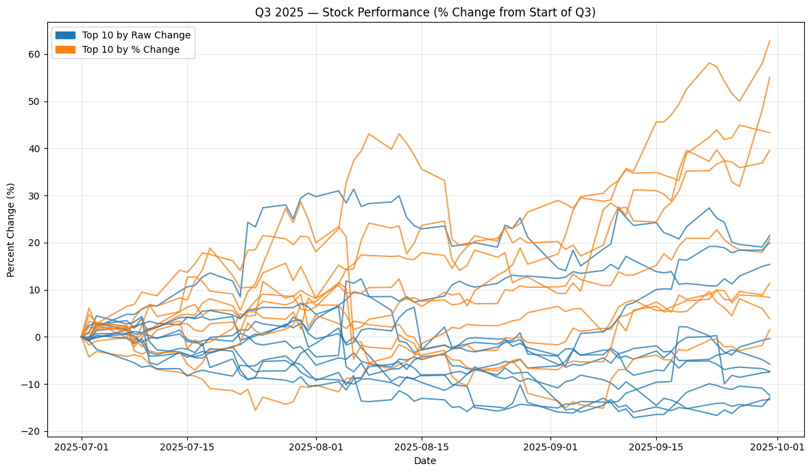

# Stock Performance Analysis with PySpark

**Exploring stock returns, momentum, and daily price movements through Apache Spark and Python.**

This project analyzes a dataset of S&P 500 stocks from the first half of 2025 and follows selected stocks into Q3. It asks whether ranking stocks by absolute price gains or percentage returns reveals different patterns in subsequent performance, and explores how large daily gains and losses relate to performance over a longer period.

Built for CSC 369 by **Michael Man and Minh Ho-Hoang**, the project demonstrates data engineering, exploratory data analysis, and financial time-series analysis in a Jupyter notebook.

**[Explore the notebook](project_notebook.ipynb)**

## Technical Highlights

- **ETL and data reshaping:** Load CSV data into Spark DataFrames and transform date-specific columns into one record per ticker and trading date using `unionByName`.
- **Spark SQL window functions:** Use `row_number` to identify period boundaries, `lag` to compare closing prices, and rolling windows to smooth time-series data.
- **Return analysis:** Rank stocks by absolute dollar gains and relative returns using DataFrame transformations and aggregations.
- **Cross-period comparison:** Retrieve Q3 closing prices with `yfinance` and normalize each price series to its first available Q3 close.
- **Data visualization:** Combine PySpark, pandas, and Matplotlib to compare stock trajectories and highlight differences between ranking methods.

## Analysis Workflow

1. **Ingest:** Download the [S&P 500 Stocks Dataset — First Half of 2025](https://www.kaggle.com/datasets/codebynadiia/s-and-p-500-stocks-dataset-first-half-2025) through `kagglehub`.
2. **Transform:** Reshape the wide CSV into `company_name`, `ticker`, `date`, `opening`, `closing`, and `volume` columns.
3. **Rank:** Compare the first available opening price with the last available closing price for each stock, then produce top-ten rankings by dollar gain and relative return.
4. **Compare:** Plot selected stocks from July through September 2025 using percentage changes from their first available Q3 closing prices.
5. **Investigate:** Calculate changes between consecutive closing prices and examine stocks associated with extreme gains and losses.

## Selected Results

The saved first-half ranking outputs illustrate why the choice of metric matters:

| Ranking metric | Leading ticker | Recorded change |
| --- | --- | --- |
| Absolute price gain | BKNG | +$798.57 per share |
| Relative price return | HOOD | Approximately +143% |

The relative-return column stores decimal ratios: for example, `1.43` represents approximately `143%`. Values are rounded in the notebook.



*Saved notebook visualization: Q3 percentage changes for the selected stocks. Blue represents the absolute-gain selection; orange represents the relative-return selection. GEV appears in both selections and is plotted in blue.*

The notebook reports that the percentage-ranked selection had fewer stocks with negative Q3 returns than the dollar-ranked selection. This is an exploratory observation from one period; the project does not train or validate a predictive model.

## Technology Stack

**Python · Apache Spark · PySpark · Spark SQL · pandas · Matplotlib · yfinance · kagglehub · Jupyter Notebook · Google Colab**

## Viewing and Running

Open [project_notebook.ipynb](project_notebook.ipynb) on GitHub to review the analysis, saved tables, and charts without installing dependencies.

For an interactive session, upload the notebook to Google Colab. Its setup cells use Ubuntu package commands and a Java 8 path intended for that environment. Install the Python dependencies in a notebook cell:

```python
%pip install pyspark==3.5.1 pandas matplotlib yfinance kagglehub PyDrive
```

The saved installation output reports PySpark 3.5.1. Data downloads require internet access. Before running all cells, address the issues below; the current notebook needs these corrections for a reliable full rerun.

## Validation Notes

- **Date parsing:** The daily-movement and start-to-end summary sections use `yyyy-MM-dd`, while the source dates use `dd-MM-yyyy`. Their saved outputs contain null dates, so those results need corrected parsing and chronological validation.
- **Ticker selection:** The Q3 dollar-gain list contains `MKC`, while the first-half ranking contains `MCK`. The Q3 comparison should be rerun with the matching ticker.
- **Rolling-average cell:** The window-average expression contains an extra closing parenthesis that must be removed before execution.

## Future Work

Extend the analysis across multiple years, generate ticker selections directly from Spark rankings, add data-quality checks, and compare results against an S&P 500 benchmark. These additions would help evaluate whether the observed patterns persist across market conditions.
